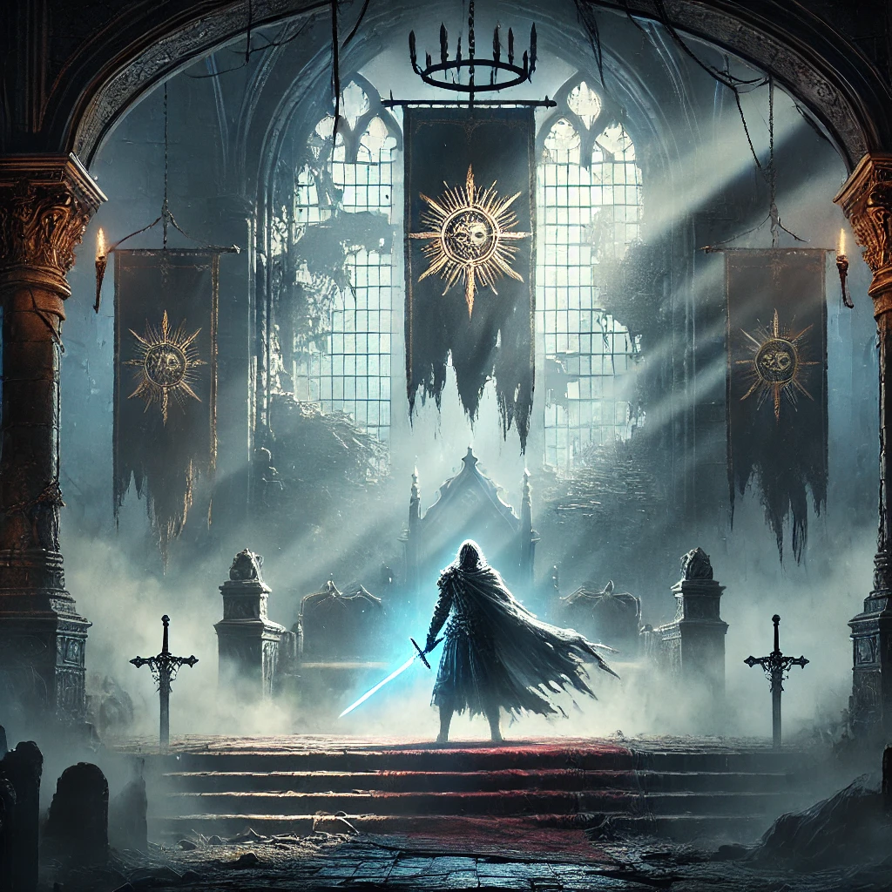

# 🌑 Realm of the Mourning Star 🌑

## כותרת המשחק וסלוגן

**כותרת**: *Realm of the Mourning Star*  
**סלוגן**: *חשוף את המורשת האבודה והכריע את גורל הממלכה המוצללת.*

---

## 🎮 תקציר המשחק
*Realm of the Mourning Star* הוא משחק פנטזיה אפל שבו השחקן נכנס לנעליו של נסיך, היורש האחרון לשושלתו המלכותית, ששורד בגידה אכזרית. לאחר שהוא מתעורר לתחייה ללא זיכרון, הוא יוצא למסע בעולם מוצל ואפל כדי לגלות את האמת על גורל משפחתו. בדרכו, יעמוד הנסיך בפני בחירות מוסריות שיקבעו את גורלו ואת עתיד הממלכה.

- **פלטפורמה**: 🖥️ מחשב אישי
- **תצוגה חזותית**: נוף אפל ועמום עם טירה הרוסה במרחק, יערות מוצלים וסמלים זוהרים המצביעים על זיכרונו האבוד וייעודו של הנסיך.

---

## 🎲 רכיבי המשחק

### 1. שחקנים
- **קהל יעד**: בני נוער ומבוגרים שאוהבים פנטזיה אפלה.
- **מספר שחקנים**: לשחקן יחיד.
- **אינטראקציה**: חקר מבוסס עלילה וקבלת החלטות.

### 2. מטרות
- **מטרה ראשית**: לגלות את האמת מאחורי גורל משפחתו של הנסיך.
- **מטרה סופית**: לבחור בין גאולה לשליטה באפלה.
- **הצגת מטרות**: המטרות מתבהרות דרך חקר, רסיסי זיכרון ואינטראקציות עם דמויות.

### 3. תהליכים
- **תחילת המשחק**: הנסיך מתעורר בטירה הרוסה, מתחיל לחקור.
- **ליבת המשחק**:
  - **חקירה**: טירות הרוסות, יערות, כפרים נטושים.
  - **קרב**: קרב מול יצורי צללים.
  - **פתרון חידות**: איסוף רסיסי זיכרון וגילוי עברו.
- **סיום המשחק**: בחירה סופית מובילה לאחד משני סיומים.

### 4. חוקים
- **הגבלות**: אזורים ויכולות נפתחים בהדרגה עם רסיסי זיכרון.
- **לימוד החוקים**: הדרכות ודיאלוגים עם דמויות ורמזים חזותיים.

### 5. משאבים
- **רסיסי זיכרון**: חושפים את עברו של הנסיך ופותחים יכולות.
- **חפצים מיסטיים**: משפרים יכולות ומאפשרים גישה לאזורים.
- **מחסור במשאבים**: מעודד חקירה.

### 6. קונפליקט
- **סוגים**:
  - **שחקן מול מערכת**: קרב וחידות.
  - **שחקן מול עצמו**: החלטות מוסריות משפיעות על הסיפור.
- **מטרת הקונפליקט**: ליצור מתח ולהעמיק את הבחירות המוסריות.

### 7. גבולות
- **מגבלות עולם**: אזורים תחומים, מחוברים ואטמוספיריים.
- **עקרונות עיצוב**:
  - **משמעות**: כל אזור מגלה חלק במסע של הנסיך.
  - **עניין והכוונה**: סביבת ייחודיות.

### 8. תוצאה
- **סיום**:
  - **גאולה**: הנסיך מאיר את הממלכה.
  - **שליט אפל**: הנסיך מצטרף לצד האפל.
- **החלטות**: לפי החלטות השחקן.

---

## 🔍 מחקר שוק

1. **Dark Souls**
   - **דמיון**: פנטזיה אפלה וחקר אתגרי.
   - **שוני**: דגש על עלילה ובחירות.

2. **Hollow Knight**
   - **דמיון**: סביבת אפלה ושחקן יחיד.
   - **שוני**: עלילה יותר מאשר אקשן.

3. **The Witcher 3**
   - **דמיון**: עלילה עשירה ובחירות מוסריות.
   - **שוני**: קו עלילה לינארי.

**נקודות ייחודיות**:
- **בחירות ועלילה**: דגש על בחירות מוסריות.
- **חקירה אטמוספירית**: סביבות עשירות.
- **משחק נגיש**: מכניקה פשוטה הממוקדת בסיפור.
